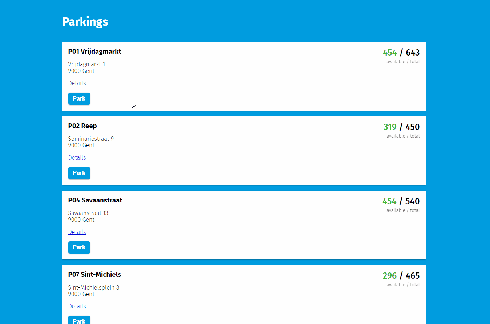

# ghent-parkings
Visualization of realtime parking data of Ghent.  
https://robrechtme.github.io/ghent-parkings/



## Installation
You need [Yarn](https://classic.yarnpkg.com/en/docs/install) and [Node.js](https://nodejs.org/en/download/) (v10 or higher) to get the development environment running. 
```bash
git clone https://github.com/RobrechtMe/ghent-parkings.git
cd ghent-parkings
yarn install
yarn start
```
Then open http://localhost:3000/ to see the app.

## Code
The project is bootstrapped with [`create-react-app`](https://create-react-app.dev/). 

### Components
All components are written as **functional components** using [React Hooks](https://reactjs.org/docs/hooks-reference.html). This design pattern will arguably replace class components over time, and it is encouraged to use them in new projects. The components in the `components` folder have been written with scalability in mind: they are made to be easily reused in the future. In the `pages` folder, all page-specific components are stored. An optional `_partials` folder contains page components that are too specific to be reused, but help splitting large pages into smaller logical units. The project is written in TypeScript, which makes reusing components much easier (this is my first time using TypeScript in React and I must say I'm a fan).  

### API
To fetch the real-time parking data, Vercel's [SWR](https://swr.vercel.app/) is used. This React Hook library first returns the data from cache (if it has made the request before) and then makes the request. When the request is finished, the cached data is updated and the component is re-rendered. The parking data is polled every 5 minutes. A custom `useParkings` hook is written such that all api functionality is separated from component functionality.   
The project does not include [React Redux](https://react-redux.js.org/) to store global state because the application is very small, so we can simply pass the component's state down to children components. 

### Styling
For styling [CSS Modules](https://github.com/css-modules/css-modules) are used, simply because it is built into create-react-app. (This is my first time using CSS modules. I have used Sass and TailwindCSS and since CSS modules is builtin in  I gave it a try. I would favor a more scalable solution like Tailwind CSS or styled-components.)

Except [normalize.css](https://github.com/csstools/normalize.css), no other CSS framework (e.g. Bootstrap, Semantic UI, ...) is used. Although this means that the grid and basic features have to be written from scratch, it comes with the benefit that no unused framework CSS is downloaded and framework rules cannot clash with own rules. 

## Deployment
The project provides two options for deployment to a production environment:

### GitHub pages
GitHub pages provides you with free static site hosting. Thanks to the [`gh-pages`](https://www.npmjs.com/package/gh-pages) package, a Node.js app can easily be deployed using:
```bash
yarn deploy
```
A minor downside is that we are forced to use the `HashRouter` of react-router-dom, which leaves a hash (#) sign in the URL.

### Docker
Alternatively, the app can be deployed anywhere using a docker container. A docker image can be built using:
```bash
docker build . -t robrechtme/ghent-parkings
```
Next, the image can be placed on a production environment (or locally) and ran using:
```bash
docker run -p 3000:80 robrechtme/ghent-parkings
```

## UI/UX
The user interface is very straightforward: 
* Users view a list of parkings with their location and availability. The color of the available spaces depends on the portion.
  (The API also provides a `suggestedfreethreshold` and `suggestedfullthreshold`, but I could not make sense of it.)  
  * < 50% full = green
  * 50-90% full = orange
  * \> 90% full = red  
* When the user presses the `Park` button, a label indicates that he is parked in that location and the button text changes to `Clear`, to indicate it is a toggle. 
* The user can also press a Details button, which routes to a new page, providing more details of the parking. This page has a separate URL, which can be bookmarked or shared.
* When the user goes to the details page and back, the 'Park' information is lost, since this is essentially the same as a page refresh. 
* The user is notified when the page is fetching the most up-to-date data through a subtle non-blocking spinner.  

Error handling:
* When the user manually types a wrong URL, a 404 page is shown with some info. A back button guides the user to the homepage. 

* When the network connection is lost, the backend server is down or an unknown error occurs, the user is shown a clean error page with more details about the error if desired. 

Possible improvements:
* Provide a map view such that users can see parkings close to them. The user can toggle between map and list view through a small toggle button.
* Provide a `Directions` button, which opens a navigation app/site.
* Translate / move all hardcoded text into separate files using `react-intl`.
