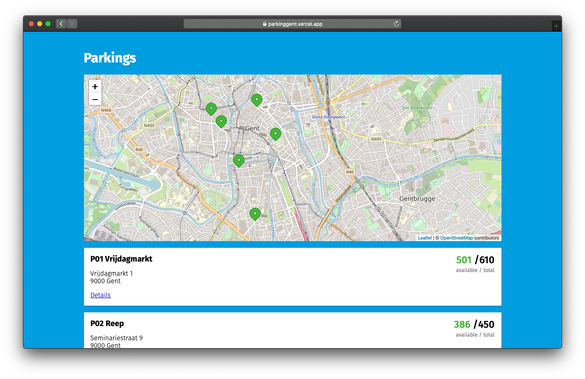

# ghent-parkings

Visualization of realtime parking data of Ghent. The parking data is openly available in the [Open Data Portal](https://data.stad.gent/) of City of Ghent.

<p align="center">https://parking-gent.robrecht.me/ </p>



## Contribute

### Installation

Runtimes are pinned via [mise](https://mise.jdx.dev/) (`.tool-versions`). Once mise is installed:

```bash
git clone https://github.com/robrechtme/ghent-parkings.git
cd ghent-parkings
mise install
pnpm install
pnpm dev
```

### Technology stack

- [Next.js](https://nextjs.org/) (App Router)
- [TypeScript](https://www.typescriptlang.org/)
- [SWR](https://swr.vercel.app/)
- [react-leaflet](https://react-leaflet.js.org/) for the map
- [CSS Modules](https://github.com/css-modules/css-modules)
- [Biome](https://biomejs.dev/) for linting and formatting

### Scripts

```bash
pnpm dev         # local dev server
pnpm build       # production build
pnpm start       # serve the production build
pnpm lint        # biome check
pnpm format      # biome format --write
pnpm typecheck   # tsc --noEmit
```

## License

This repository is licensed under MIT.
